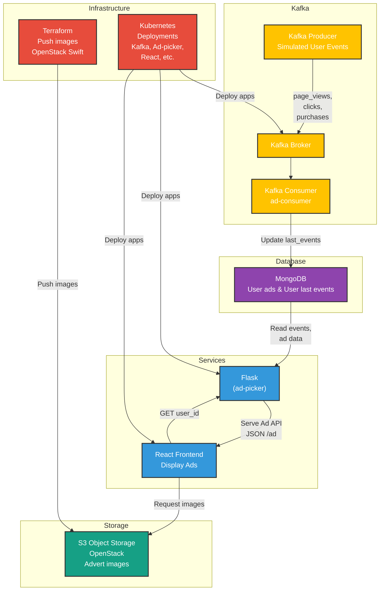
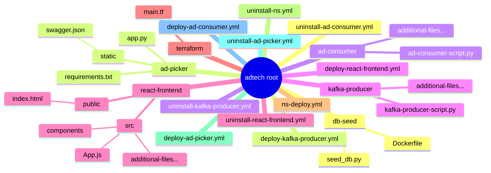

# Kafka-AdTech Demo

This repository demonstrates a **full-stack advertising engine** workflow using the following technologies:

- **Kafka** to stream simulated user events (page_views, clicks, purchases).
- **MongoDB** to store user ads and last user events.
- **Flask** (ad-picker) to serve an Ad API that picks ads based on the last user event.
- **React** (frontend) to display dynamic ads to users.
- **Terraform** to push images to OpenStack Swift.
- **Kubernetes** manifests to deploy everything: ad-picker, ad-consumer, kafka-producer, React app, etc.
- **OpenStack** S3 Object storage for advert images

---

## Architecture Overview

1. The **Kafka Producer** (`kafka-producer`) sends random user events (`page_view`, `click`, `purchase`) to Kafka.  
2. The **Kafka Consumer** (`ad-consumer`) reads those events, updates the **`last_events`** collection in MongoDB for each user.  
3. The **ad-picker** (a **Flask** API) checks the user’s last event and picks the correct ad from the **`ads`** collection, returning JSON data (title + image).  
4. The **React** **frontend** calls `/ad?user_id=<random>` and displays the returned ad.  

---

## Directory Structure

---

## High Level File Overview

- **`ns-deploy.yml / uninstall-ns.yml`**: Creates or removes the Kubernetes namespace `adtech`.

- **`deploy-ad-picker.yml` / `uninstall-ad-picker.yml`**: Manages the Flask-based Ad Picker.

- **`deploy-ad-consumer.yml` / `uninstall-ad-consumer.yml`**: Manages the Kafka Consumer that updates MongoDB with last user events.

- **`deploy-kafka-producer.yml` / `uninstall-kafka-producer.yml`**: Manages the Kafka Producer that generates random user events.

- **`deploy-react-frontend.yml` / `uninstall-react-frontend.yml`**: Manages the React Frontend.

- **`deploy-images-to-s3-bucket.yml` / `uninstall-images-from-s3-bucket.yml`**: Used to deploy and destroy the advertising images in openstack.

- **`db-seed/`**: Contains a **`seed_db.py`** script + Dockerfile to seed the `ads` collection in MongoDB with sample ads.

- **`ad-picker/`**: The **Flask** API serving ads. Includes `app.py`, `requirements.txt`, and a `static/swagger.json` for Swagger docs.

- **`ad-consumer/`**: A **Python** Kafka Consumer that listens for user events and updates MongoDB with last user actions.

- **`kafka-producer/`**: A **Python** script that generates random user events and sends to Kafka.

- **`react-frontend/`**: A **React** application that fetches `/ad?user_id=<random>` from the Ad Picker API and displays the returned ad.

- **`terraform/`**: Example **Terraform** code (including `main.tf`) to push images to OpenStack Swift (S3-like object storage).

---

## Purpose of This Demo

1. **Showcase a Full Data Pipeline**: From **user events** (Kafka producers) → **Kafka** → **Consumer** → **MongoDB** → **Flask** API → **React** UI.

2. **Demonstrate** how you might store user actions and use them to **pick targeted ads** dynamically.

3. **Integration** with **OpenStack Swift** for storing ad images in an S3-compatible bucket.

4. **Kubernetes** deployment for each service, illustrating a microservice architecture.

---

## Future Expandability

- **AI/ML or ETL**: A **Spark** or **Flink** job to analyze user behavior, then run more advanced recommendations or predictive models.

- **React Native Mobile App**: The same **Flask** `ad-picker` API can serve a React Native front end for mobile.

- **Real-World Ad Engine**: This architecture resembles many real advertising backends, where **user events** are captured, stored in a **NoSQL** DB
  or DWH, and an **ad server** picks the best ad based on those events. Typically, a **recommendation engine** or real-time bidding (RTB) system
  might be included for more advanced targeting of ads.

---

## Usage

1. **Set up** your environment:
   - Kubernetes cluster, Kafka cluster (or single broker), and MongoDB replicaset.
   - Ansible for deployments (or direct `kubectl` usage).

2. **Deploy**:
   - `ansible-playbook ns-deploy.yml` (if needed).
   - `ansible-playbook deploy-ad-picker.yml`, `deploy-ad-consumer.yml`,
     `deploy-kafka-producer.yml`, `deploy-react-frontend.yml`, etc.

3. **Seed** the database:
   - `ansible-playbook deploy-ad-tech-mongo-db.yml` (if that’s your custom file to stand up Mongo).
   - Then run the `db-seed/job-db-seed.yaml` (or a corresponding Ansible play) to populate ads in the `ads` collection.

4. **Test**:
   - Visit your **React** front end URL. You should see a random user ID and random user action plus an image.
   - Refresh or click **“Get Another Ad”** to see new ads.

5. **Uninstall**:
   - `ansible-playbook uninstall-ad-picker.yml`, `uninstall-react-frontend.yml`, etc., to remove components.

---

## A Working Version

1. **API**:
   - https://api.adtech.ny5.os.tunninet.com/docs/

2. **React Frontend**:
   - https://adtech.ny5.os.tunninet.com/

---

## Notes

1. This Software is shared 'as-is' and is not a work in progress, only an example of how ad tech works. 

---

## Author

This is Created by: Noel Ashford

## License

[MIT License](https://opensource.org/licenses/MIT)